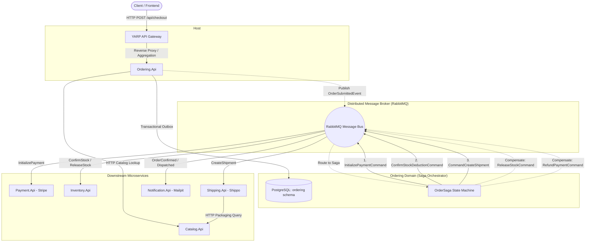

# Logan: Distributed Order Fulfillment & Settlement Engine

[](https://dotnet.microsoft.com/)
[](https://learn.microsoft.com/dotnet/csharp/)
[](https://wolverine.netlify.app/)
[](https://www.rabbitmq.com/)
[](https://www.postgresql.org/)
[](https://opentelemetry.io/)
[](https://learn.microsoft.com/dotnet/aspire/)
[](https://microsoft.github.io/reverse-proxy/)

Event-driven microservices fulfillment engine built with .NET 10, Wolverine, RabbitMQ, and PostgreSQL, implementing distributed saga orchestration, transactional outbox delivery, and OpenTelemetry tracing.

---

## Architecture Overview

Logan models a modern e-commerce checkout and logistics fulfillment engine across isolated bounded contexts:



---

## Key Distributed Systems Patterns

### 1. Saga Orchestration & Cascading Compensations
Long-running business workflows span multiple independent services without distributed 2PC (Two-Phase Commit) locks:
* **Happy Path:** `OrderSubmitted` $\to$ `InitializePayment` $\to$ `PaymentCompleted` $\to$ `ConfirmStockDeduction` + `CreateShipment` $\to$ `ShipmentLabelPurchased` $\to$ `OrderCompleted`.
* **Compensating Transactions (Rollbacks):**
  * If payment fails $\to$ Saga triggers `ReleaseStockCommand` to return held inventory.
  * If shipping label purchase fails after successful payment $\to$ Saga dispatches dual rollbacks: `RefundPaymentCommand` (Stripe refund) and `ReleaseStockCommand`.
* **Durable TTL Timeouts:** Checkouts scheduled with a 15-minute hold TTL (`OrderPaymentTimeout`); abandoned checkouts automatically expire and release reserved inventory.

### 2. Guaranteed Delivery & Transactional Outbox
Dual-write race conditions between the relational database and the message broker are eliminated using **Wolverine PostgreSQL Message Persistence**:
* State modifications and outgoing message envelopes commit inside the same database transaction.
* Background workers guarantee at-least-once message delivery over RabbitMQ even across transient network partitions or broker outages.

### 3. Concurrency & Flash-Sale Mitigation
* **Pessimistic Row-Level Locks:** High-contention inventory decrementing uses atomic database locking (`FOR UPDATE` via `LockStockItemsForUpdateAsync`) to prevent overselling under high concurrency.
* **Audit Ledger:** Stock reservations and confirmations are tracked in an immutable `StockMovement` ledger recording quantity adjustments, order correlations, and timestamps.

### 4. Full-Stack Distributed Observability
* Instrumented with **OpenTelemetry (OTLP)** across ASP.NET Core, HTTP Client calls, and Npgsql queries.
* **W3C Distributed Trace Context:** Traces propagate across asynchronous RabbitMQ boundaries (`HTTP Request` $\to$ `Outbox` $\to$ `Broker` $\to$ `Saga` $\to$ `Downstream Services`).
* **Noise Filtering:** Custom OpenTelemetry processor (`WolverineNoiseFilterProcessor`) filters out high-frequency polling envelopes and heartbeat activities, ensuring clean trace timelines in the Aspire Dashboard.

---

## Microservices Breakdown

| Service | Port | Database Schema | Responsibilities |
| :--- | :---: | :--- | :--- |
| **ApiGateway** | `5000` | — | YARP reverse proxy, edge routing, unified checkout orchestration endpoint. |
| **Ordering.Api** | `5001` | `ordering` | Order lifecycle aggregate, `OrderSaga` orchestrator, read-model order summaries. |
| **Inventory.Api** | `5002` | `inventory` | SKU stock levels, temporary reservation holds with TTL, stock movement ledger. |
| **Payment.Api** | `5003` | `payment` | Stripe PaymentIntent lifecycle, idempotent webhook ingestion, refunds. |
| **Shipping.Api** | `5004` | `shipping` | Shippo label purchase, packaging volume estimation, carrier rate quotes. |
| **Catalog.Api** | `5005` | `catalog` | Product catalog, dimensional attributes (weight/volume), SKU metadata. |
| **Notification.Api** | `5006` | `notification` | Transactional order emails (Mailpit SMTP) and SMS logging. |

---

## Getting Started

### Prerequisites
* [.NET 10 SDK](https://dotnet.microsoft.com/download/dotnet/10.0)
* [Docker Desktop](https://www.docker.com/) / Podman

### Option 1: Run with .NET Aspire (Recommended for Local Dev)
Aspire coordinates all microservices and provides the real-time telemetry dashboard:

```bash
# 1. Start backing services (PostgreSQL, RabbitMQ, Mailpit)
docker compose up -d postgres rabbitmq mailpit

# 2. Launch the AppHost
dotnet run --project src/Host/Logan.AppHost
```

Navigate to the Aspire Dashboard URL printed in the console (default `http://localhost:18888`) to monitor live traces, metrics, and structured logs.

### Option 2: Run via Docker Compose
To run the full stack containerized:

```bash
docker compose up --build -d
```

* API Gateway: `http://localhost:5000`
* RabbitMQ Management: `http://localhost:15672` (guest / guest)
* Mailpit Web UI: `http://localhost:8025`

---

## End-to-End Walkthrough

### 1. View Available Products
```bash
curl -X GET "http://localhost:5000/api/products"
```

### 2. Estimate Shipping Rates
```bash
curl -X POST "http://localhost:5000/api/shipping/rates" \
  -H "Content-Type: application/json" \
  -d '{
    "destinationAddress": {
      "street1": "1600 Amphitheatre Pkwy",
      "city": "Mountain View",
      "state": "CA",
      "postalCode": "94043",
      "country": "US"
    },
    "items": [
      { "sku": "LAPTOP-PRO-15", "quantity": 1 }
    ]
  }'
```

### 3. Submit Checkout
```bash
curl -X POST "http://localhost:5000/api/checkout" \
  -H "Content-Type: application/json" \
  -d '{
    "customerId": "01940000-0000-7000-8000-000000000001",
    "currency": "USD",
    "providerRateId": "rate_mock_ground",
    "destinationAddress": {
      "street1": "1600 Amphitheatre Pkwy",
      "city": "Mountain View",
      "state": "CA",
      "postalCode": "94043",
      "country": "US"
    },
    "items": [
      { "sku": "LAPTOP-PRO-15", "quantity": 1 }
    ]
  }'
```

---

## Repository Structure

```
Logan/
├── Api.slnx                       # Solution definition (.NET 10 slnx format)
├── docker-compose.yml             # Infrastructure & microservice containers
├── src/
│   ├── BuildingBlocks/
│   │   ├── BuildingBlocks.Common/     # Value objects (Sku, Price), results, middleware
│   │   ├── BuildingBlocks.Messaging/  # Wolverine & RabbitMQ conventions, retry policies
│   │   └── BuildingBlocks.Persistence/# EF Core PostgreSQL helpers, schema isolation
│   ├── Host/
│   │   ├── ApiGateway/                # YARP edge proxy & checkout aggregation
│   │   └── Logan.AppHost/             # .NET Aspire orchestration AppHost
│   └── Services/
│       ├── Catalog/                   # Product catalog & dimensions
│       ├── Inventory/                 # Stock reservation & ledger
│       ├── Notification/              # Email/SMS notification dispatcher
│       ├── Ordering/                  # Order aggregate & OrderSaga orchestrator
│       ├── Payment/                   # Stripe gateway & webhooks
│       └── Shipping/                  # Shippo logistics & parcel packaging
└── tests/
    └── IntegrationTests/              # E2E Saga & Testcontainers integration tests
```

---

## License

This project is licensed under the MIT License.
